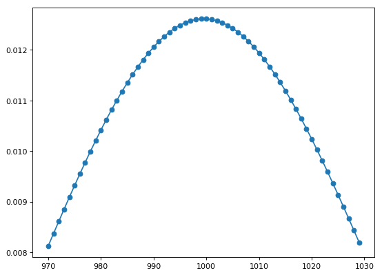
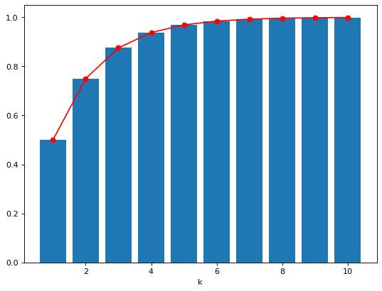

# Distribution
Covering the major kinds of distributions (visualization via a <a href="./distribution.py">Python code</a> I built)

1. <a href="https://en.wikipedia.org/wiki/Normal_distribution">Normal (Gaussian) distribution</a>

According to the <a href="./central_limit_theorem.md">**central limit theorem**</a>, with sample size n ≥ 30 (that is, a sufficiently large sample size), regardless the distribution of the population, all the sample mean will follow a (1) <a href="https://en.wikipedia.org/wiki/Normal_distribution">normal distribution</a> (a continuous probability distribution), (2) the mean of all samples will be approximately equal to the mean of the population, and (3) the variance of all the sample means will be equal to the variance of the population **divided** by sample size.

Probability Density Function | Cumulative Distribution Function
--- | ---
 | 

2. <a href="https://en.wikipedia.org/wiki/Multivariate_normal_distribution">Multivariate normal distribution</a>

Example | Probability Density Function | Cumulative Distribution Function
--- | --- | ---
Bivariate (<a href="./Grapher/bivariate_normal_grapher_example.gcx">Grapher example</a>) |  | 

3. <a href="https://en.wikipedia.org/wiki/Student%27s_t-distribution">Student's t-distribution</a>

Used in <a href="https://lvdmaaten.github.io/tsne/">t-SNE</a>

<i>df</i> | Probability Density Function | Cumulative Distribution Function
--- | --- | --- 
1 |  | 

4. <a href="https://en.wikipedia.org/wiki/Poisson_distribution">Poisson distribution</a>

A **discrete** probability distribution that expresses the probability of a given number of **discrete** events (e.g., number of visitors on an Amazon website) occurring in a fixed interval of time (e.g., between 10:00-10:30pm on a Tuesday night) or space if these events occur with a known constant rate (e.g., on average, there are 1000 visitors between 10-10:30pm on a Tuesday night) and independently of the time since the last event.

Example: the probability of n visitiors between 10-10:30am on a Tuesday night: 

5. <a href="https://en.wikipedia.org/wiki/Bernoulli_distribution">Bernoulli distribution</a>

Used in <a href="https://en.wikipedia.org/wiki/Naive_Bayes_classifier">Naive Bayesian classifier</a>

p | Probability Mass Function | Cumulative Distribution Function
--- | --- | ---
0.7 |  | 

6. <a href="https://en.wikipedia.org/wiki/Binomial_distribution">Binomial distribution</a>

A **discrete** probability distribution of the number of successes in a sequence of n independent experiments (e.g., n=10 coins tossed), each asking a yes–no question (e.g., coin toss being a head or tail).

p of head | n coin tosses | Probability Mass Function | Cumulative Distribution Function
--- | --- | --- | ---
0.5 | 10 |  | 

Here is a R-based <a href="https://danielyang.shinyapps.io/Binomial_distribution/">Shiny app</a> I created to play around the number of total coin tosses and visualize the changes in the distribution.

7. <a href="https://en.wikipedia.org/wiki/Multinomial_distribution">Multinomial distribution</a>

The probability of counts for each side of a k≥2-sided dice rolled n times (if k=2, it's a binomial distribution)

Let's say we have a 6-sided (k=6) fair dice, thus each side probability is defined by p = [1/6, 1/6, 1/6, 1/6, 1/6, 1/6]

Then ...

If we roll the dice n times | Number of occurrences for each side | Probability Mass Function
--- | --- | ---
n = 2 | [1, 0, 0, 0, 1, 0] | 0.05555556
n = 2 | [0, 2, 0, 0, 0, 0] | 0.02777778

8. <a href="https://en.wikipedia.org/wiki/Geometric_distribution">Geometric distribution</a>

It gives the probability that the first k − 1 trials are failures, while the kth trial is the first success.

p of head | Probability Mass Function | Cumulative Distribution Function
--- | --- | ---
0.5 |  | 

9. <a href="https://en.wikipedia.org/wiki/Logistic_distribution">Logistic distribution</a>

A continuous probability distribution that has important roles in logistic regression and neural networks.
Its shape looks like a bell shape, but it tends to have heavier tails than a normal distribution

Example: 
loc/mu | scale | Probability Density Function | Cumulative Distribution Function
--- | --- | --- | ---
10 | 1 |  | 

Related: <a href="https://github.com/yj-danielyang/logistic-regression">My logistic regression webpage</a>

10. <a href="https://en.wikipedia.org/wiki/Chi-square_distribution">Chi-square distribution</a>

Example:
<i>df</i> | Probability Density Function | Cumulative Distribution Function
--- | --- | ---
<i>df</i> = 1 |  | 
<i>df</i> = 3 |  | 

11. Other distributions: 

Distribution | Use
--- | ---
<a href="https://en.wikipedia.org/wiki/Beta_distribution">Beta distribution</a> | ---
<a href="https://en.wikipedia.org/wiki/Beta-binomial_distribution">Beta-binomial distribution</a> | <a href="https://towardsdatascience.com/calogica-com-dice-polls-dirichlet-multinomials-eca987e6ec3f">reference</a>
<a href="https://en.wikipedia.org/wiki/Gamma_distribution">Gamma distribution</a> | ---
Gamma-Poisson distribution | <a href="https://towardsdatascience.com/calogica-com-dice-polls-dirichlet-multinomials-eca987e6ec3f">reference</a>
<a href="https://en.wikipedia.org/wiki/Dirichlet_distribution">Dirichlet distribution</a> | ---
Dirichlet-Multinomial distribution | <a href="https://towardsdatascience.com/calogica-com-dice-polls-dirichlet-multinomials-eca987e6ec3f">reference</a>
<a href="https://en.wikipedia.org/wiki/Negative_binomial_distribution">Negative binomial distribution | ---
<a href="https://en.wikipedia.org/wiki/Box%E2%80%93Cox_distribution">Box-Cox distribution</a> (power-normal distribution) | glmnet()
<a href="https://en.wikipedia.org/wiki/F-distribution">F-distribution</a> | ANOVA
  

#### References:

* Here is a <a href="https://gallery.shinyapps.io/dist_calc/">Shiny App</a> that covers 5 different distriubtions: Normal, Binomial, t, F, Chi-squared. Here is <a href="https://leonawicz.github.io/blog/post/shiny-app-distributions-of-random-variables/">another one</a> that is pretty cool!

