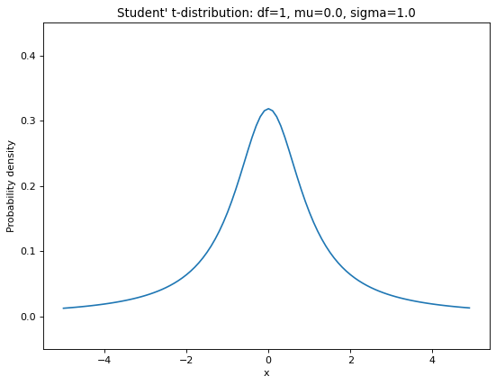

# distribution
Covering the major kinds of distributions

1. <a href="https://en.wikipedia.org/wiki/Normal_distribution">Normal (Gaussian) distribution</a>

According to the <a href="./central_limit_theorem.md">**central limit theorem**</a>, with sample size n>=30 (that is, a sufficiently large sample size), regardless the distribution of the population, all the sample mean will follow a (1) <a href="https://en.wikipedia.org/wiki/Normal_distribution">normal distribution</a> (a continuous probability distribution), (2) the mean of all samples will be approximately equal to the mean of the population, and (3) the variance of all the sample means will be equal to the variance of the population **divided** by sample size.

Probability Density Function | Cumulative Distribution Function
--- | ---
 | 

2. <a href="https://en.wikipedia.org/wiki/Student%27s_t-distribution">Student's t-distribution</a>

Used in <a href="https://lvdmaaten.github.io/tsne/">t-SNE</a>

<i>df</i> | Probability Density Function | Cumulative Distribution Function
--- | --- | ---
1 |  | 

3. <a href="https://en.wikipedia.org/wiki/Poisson_distribution">Poisson distribution</a>

A **discrete** probability distribution that expresses the probability of a given number of **discrete** events (e.g., number of visitors on an Amazon website) occurring in a fixed interval of time (e.g., between 10:00-10:30pm on a Tuesday night) or space if these events occur with a known constant rate (e.g., on average, there are 1000 visitors between 10-10:30pm on a Tuesday night) and independently of the time since the last event.

Example: the probability of n visitiors between 10-10:30am on a Tuesday night: 

4. <a href="https://en.wikipedia.org/wiki/Bernoulli_distribution">Bernoulli distribution</a>

Used in <a href="https://en.wikipedia.org/wiki/Naive_Bayes_classifier">Naive Bayesian classifier</a>

p | Probability Mass Function | Cumulative Distribution Function
--- | --- | ---
0.7 |  | 

5. <a href="https://en.wikipedia.org/wiki/Binomial_distribution">Binomial distribution</a>

A **discrete** probability distribution of the number of successes in a sequence of n independent experiments (e.g., n=10 coins tossed), each asking a yes–no question (e.g., coin toss being a head or tail).

Example: the probability of heads over 10 coin tosses: 

Here is a R-based <a href="https://danielyang.shinyapps.io/Binomial_distribution/">Shiny app</a> I created to play around the number of total coin tosses and visualize the changes in the distribution.

6. <a href="https://en.wikipedia.org/wiki/Logistic_distribution">Logistic distribution</a>

A continuous probability distribution that has important roles in logistic regression and neural networks.
Its shape looks like a bell shape, but it tends to have heavier tails than a normal distribution

Example: 
loc/mu | scale | Probability Density Function | Cumulative Distribution Function
--- | --- | --- | ---
10 | 1 |  | 

Related: <a href="https://github.com/yj-danielyang/logistic-regression">My logistic regression webpage</a>

7. <a href="https://en.wikipedia.org/wiki/Chi-square_distribution">Chi-square distribution</a>

Example:
<i>df</i> | Probability Density Function | Cumulative Distribution Function
--- | --- | ---
<i>df</i> = 1 |  | 
<i>df</i> = 3 |  | 

8. Here is a <a href="https://gallery.shinyapps.io/dist_calc/">Shiny App</a> I found that covers 5 different distriubtions: Normal, Binomial, t, F, Chi-squared. Here is <a href="https://leonawicz.github.io/blog/post/shiny-app-distributions-of-random-variables/">another one</a> that is pretty cool!
